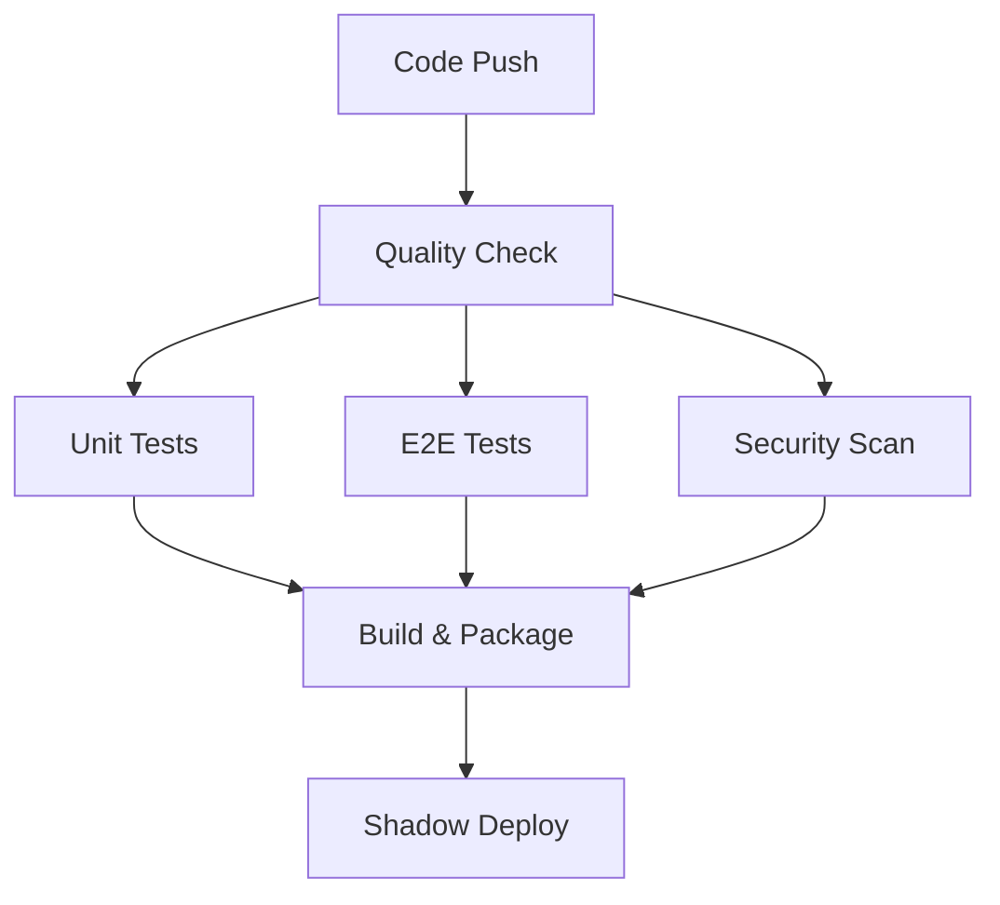

# CI/CD & Deployment Guide for AI Forsikringsguiden

## 🚀 Overview

AI Forsikringsguiden implementerer en omfattende CI/CD pipeline med fokus på kvalitet, sikkerhed og pålidelig deployment. Systemet understøtter shadow deployment, automated testing og intelligent rollback.

## 🏗️ Pipeline Architecture

### 1. Continuous Integration (CI)



### 2. Deployment Environments

| Environment | Purpose | URL | Auto-Deploy |
|-------------|---------|-----|-------------|
| **Development** | Local development | localhost:3000 | Manual |
| **Shadow Staging** | Pre-production testing | shadow-staging.vercel.app | Auto (develop branch) |
| **Staging** | Integration testing | staging.vercel.app | Auto (main branch) |
| **Production** | Live application | ai-forsikringsguiden.vercel.app | Manual approval |

## 🔧 Setup & Configuration

### 1. GitHub Secrets

Konfigurer følgende secrets i GitHub repository:

```bash
# Vercel Deployment
VERCEL_TOKEN=your_vercel_token
VERCEL_ORG_ID=your_org_id
VERCEL_PROJECT_ID=your_project_id
VERCEL_SHADOW_PROJECT_ID=your_shadow_project_id

# Environment URLs
STAGING_URL=https://staging.ai-forsikringsguiden.vercel.app
PRODUCTION_URL=https://ai-forsikringsguiden.vercel.app

# Monitoring & Alerts
MONITORING_API_KEY=your_monitoring_key
SLACK_WEBHOOK=your_slack_webhook_url

# Database (if applicable)
DATABASE_URL=your_database_url
```

### 2. Local Development Setup

```bash
# Clone repository
git clone https://github.com/your-org/ai-forsikringsguiden.git
cd ai-forsikringsguiden

# Install dependencies
npm install

# Setup environment
cp env.example .env.local
# Edit .env.local with your configuration

# Start development server
npm run dev
```

## 🧪 Testing Strategy

### 1. Test Pyramid

```
    /\
   /  \     E2E Tests (Playwright)
  /____\    - User flows
 /      \   - Error handling
/__________\ - Performance
             
             Integration Tests
             - API endpoints
             - Component integration
             
             Unit Tests (Jest)
             - Business logic
             - Utilities
             - Components
```

### 2. Test Commands

```bash
# Unit Tests
npm run test                    # Run unit tests
npm run test:watch             # Watch mode
npm run test:coverage          # With coverage

# E2E Tests
npm run test:e2e               # All E2E tests
npm run test:e2e:ui            # With UI
npm run test:e2e:headed        # Headed mode
npm run test:e2e:debug         # Debug mode

# Comprehensive Testing
npm run test:all               # Unit + E2E
./scripts/run-tests.sh         # Full test suite (Linux/Mac)
.\scripts\run-tests.ps1        # Full test suite (Windows)
```

### 3. Quality Gates

Alle deployments skal passere følgende quality gates:

- ✅ **ESLint** - Code quality og style
- ✅ **TypeScript** - Type safety
- ✅ **Unit Tests** - 80%+ coverage
- ✅ **E2E Tests** - Critical user flows
- ✅ **Security Audit** - No high/critical vulnerabilities
- ✅ **Performance** - Core Web Vitals thresholds
- ✅ **Accessibility** - WCAG compliance

## 🌙 Shadow Deployment

### Concept

Shadow deployment kører en parallel version af applikationen med production-like data for at teste ændringer uden at påvirke brugere.

### Workflow

1. **Trigger**: Push til `develop` branch eller PR til `main`
2. **Deploy**: Automatisk deployment til shadow environment
3. **Test**: Comprehensive test suite køres mod shadow deployment
4. **Analysis**: Performance og security analysis
5. **Report**: Resultater rapporteres i PR comments
6. **Cleanup**: Shadow environment ryddes op automatisk

### Shadow Test Suites

```bash
# Error Handling Tests
npx playwright test tests/e2e/error-handling.spec.ts

# Performance Tests
npx playwright test tests/e2e/performance-monitoring.spec.ts

# User Flow Tests
npx playwright test tests/e2e/user-flows.spec.ts

# Load Testing
k6 run load-test.js

# Security Scanning
zap-baseline.py -t $SHADOW_URL
```

## 🚀 Deployment Process

### 1. Automated Deployment (Staging)

```yaml
# Triggers
- Push to main branch
- Manual workflow dispatch

# Process
1. Quality gates
2. Build application
3. Deploy to staging
4. Run smoke tests
5. Monitor deployment
```

### 2. Production Deployment

```yaml
# Triggers
- Manual approval after staging success
- Workflow dispatch with production environment

# Process
1. Additional security checks
2. Staging health verification
3. Production deployment
4. Comprehensive monitoring
5. Rollback capability
```

### 3. Manual Deployment

```bash
# Deploy to staging
./scripts/deploy.sh staging

# Deploy to production
./scripts/deploy.sh production

# Force deploy (skip quality gates)
./scripts/deploy.sh staging true

# Deploy without tests
./scripts/deploy.sh staging false true
```

## 📊 Monitoring & Alerting

### 1. Health Monitoring

```javascript
// Automated health checks
const healthChecks = [
  { name: 'homepage', path: '/' },
  { name: 'health_api', path: '/api/health' },
  { name: 'status_api', path: '/api/status' },
  { name: 'chat_page', path: '/chat' }
];
```

### 2. Performance Monitoring

```javascript
// Performance thresholds
const thresholds = {
  lcp: { good: 2500, poor: 4000 },      // ms
  fid: { good: 100, poor: 300 },        // ms
  cls: { good: 0.1, poor: 0.25 },       // score
  pageLoad: { good: 3000, poor: 5000 }  // ms
};
```

### 3. Alert Levels

| Level | Trigger | Action |
|-------|---------|--------|
| **Info** | Deployment success | Slack notification |
| **Warning** | Performance degradation | Slack alert |
| **Critical** | Health check failure | PagerDuty + Slack |
| **Emergency** | Multiple system failures | Phone + Email + Slack |

## 🔄 Rollback Strategy

### 1. Automatic Rollback

```bash
# Triggers
- Health check failures
- Performance degradation
- Critical errors in monitoring

# Process
1. Stop traffic to failed deployment
2. Revert to previous stable version
3. Clear caches
4. Verify rollback success
5. Alert team
```

### 2. Manual Rollback

```bash
# Vercel rollback
vercel rollback --token $VERCEL_TOKEN

# Custom rollback script
./scripts/rollback.sh [deployment-id]
```

## 🔒 Security & Compliance

### 1. Security Scanning

```yaml
# Automated scans
- OWASP ZAP baseline scan
- npm audit for vulnerabilities
- Secrets detection with TruffleHog
- Container security scanning
```

### 2. GDPR Compliance

```yaml
# Data protection measures
- Audit logging af alle deployments
- Encrypted secrets management
- Data retention policies
- Right to deletion implementation
```

### 3. Access Control

```yaml
# Deployment permissions
- Staging: Developers + CI/CD
- Production: Senior developers + DevOps
- Emergency: On-call engineers
```

## 📈 Performance Optimization

### 1. Build Optimization

```javascript
// Next.js optimization
module.exports = {
  experimental: {
    optimizeCss: true,
    optimizeImages: true
  },
  compiler: {
    removeConsole: process.env.NODE_ENV === 'production'
  }
};
```

### 2. Deployment Optimization

```yaml
# Vercel configuration
- Edge caching
- Image optimization
- Automatic compression
- CDN distribution
```

## 🛠️ Troubleshooting

### Common Issues

#### 1. Build Failures

```bash
# Check build logs
npm run build

# Clear cache and rebuild
rm -rf .next node_modules
npm install
npm run build
```

#### 2. Test Failures

```bash
# Run tests locally
npm run test:e2e:debug

# Check test artifacts
ls test-results/
```

#### 3. Deployment Issues

```bash
# Check Vercel logs
vercel logs

# Manual health check
curl -f https://your-app.vercel.app/api/health
```

### Debug Commands

```bash
# Verbose deployment
./scripts/deploy.sh staging false false --verbose

# Test specific environment
PLAYWRIGHT_BASE_URL=https://staging.app npx playwright test

# Monitor production
node scripts/monitor-production.js
```

## 📚 Best Practices

### 1. Development Workflow

1. **Feature Branch** - Udvikl i feature branches
2. **Pull Request** - Opret PR med beskrivelse
3. **Shadow Testing** - Automatisk shadow deployment
4. **Code Review** - Peer review før merge
5. **Staging Deploy** - Automatisk efter merge til main
6. **Production Deploy** - Manuel godkendelse

### 2. Testing Best Practices

1. **Test Pyramid** - Flere unit tests, færre E2E tests
2. **Page Object Model** - Strukturerede E2E tests
3. **Test Data** - Isolerede test data
4. **Parallel Execution** - Hurtigere test execution
5. **Flaky Test Management** - Retry logic og stabilitet

### 3. Deployment Best Practices

1. **Blue-Green Deployment** - Zero-downtime deployments
2. **Feature Flags** - Gradual feature rollout
3. **Database Migrations** - Backward compatible changes
4. **Monitoring** - Comprehensive observability
5. **Rollback Plan** - Altid have en rollback strategi

## 🔗 Links & Resources

- [GitHub Actions Workflows](.github/workflows/)
- [Deployment Scripts](../scripts/)
- [Test Documentation](../tests/)
- [Monitoring Dashboard](https://monitoring.ai-forsikringsguiden.dk)
- [Vercel Dashboard](https://vercel.com/dashboard)

---

*Opdateret: $(date)*
*Version: 1.0.0* 